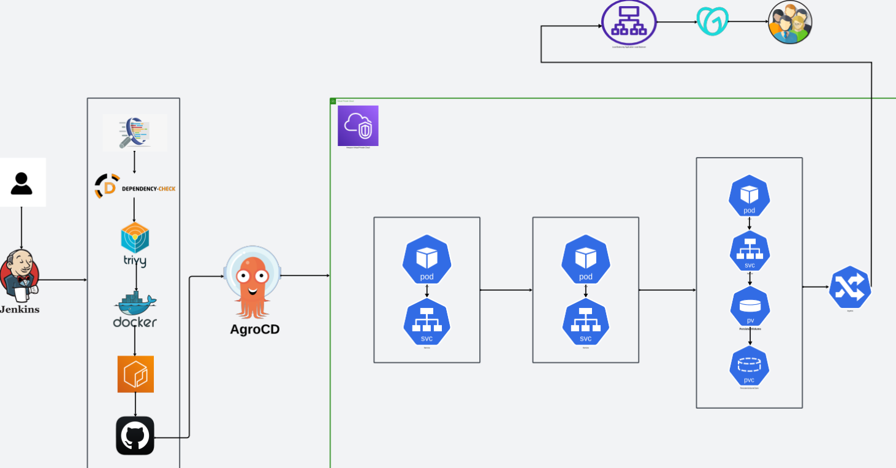

Project on building a Complete CI/CD Pipeline using Jenkins, ArgoCD, and Amazon EKS for a Three-Tier Application! 🚀🛠️

Key Steps:

1️⃣ Jenkins Setup:
Installed Jenkins on an EC2 instance with Docker, AWS CLI, and kubectl for CI/CD operations. 🛠️

2️⃣ VPC & EKS Cluster:
Created a VPC and deployed an EKS Cluster using eksctl to manage containerized applications. 🌐

3️⃣ Load Balancer Configuration:
Set up an AWS ALB with ingress to handle traffic routing for services in the EKS cluster. ⚙️

4️⃣ ECR Repositories:
Created Amazon ECR repositories to store Docker images for both frontend and backend services. 🐳

5️⃣ ArgoCD Installation:
Installed ArgoCD for continuous delivery and automated deployments in the EKS cluster. 🚀

6️⃣ SonarQube Integration:
Integrated SonarQube for automated code quality and security checks. 🔐

7️⃣ Jenkins Pipeline Creation:
Built a Jenkins pipeline to deploy backend code into the EKS cluster via ArgoCD. 📜

8️⃣ Monitoring & DNS Configuration:
Implemented Prometheus and Grafana for monitoring and configured DNS for ALB to ensure application accessibility. 🌍
